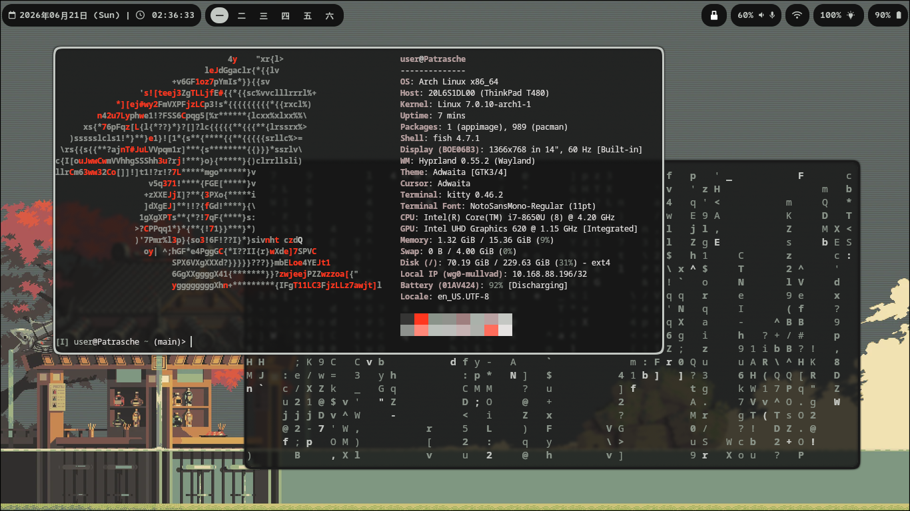

# My Hyprland Rice (Arch)

> A personal Hyprland setup on Arch Linux with dynamic **Material You** theming generated from the wallpaper and applied system-wide.

Not all code in this repo is 100% my creation, this setup was heavily inspired by [**binnewbs/arch-hyprland**](https://github.com/binnewbs/arch-hyprland)

<!-- TODO: replace the placeholders below with real screenshots/GIFs -->



<p align="center">
  
  
</p>

Pick a wallpaper and the entire desktop — Hyprland borders, Waybar, kitty and rofi — recolors itself to match, in a single keystroke. The color palette is generated from the image with [**matugen**](https://github.com/InioX/matugen) following Google's [**Material You**](https://m3.material.io/styles/color/system/overview) color system.

## Highlights

- **Compositor:** [Hyprland](https://hypr.land/) on Wayland.
- **Dynamic theming:** a Material You palette derived from the current wallpaper with `matugen`, applied to Hyprland, Waybar, kitty and rofi at once.
- **One keystroke:** a keybind opens a `rofi` wallpaper picker; choosing an image sets it (via [`awww`](https://codeberg.org/LGFae/awww)) and re-themes everything.
- **Live recolor:** running kitty instances are recolored on the fly, no restart needed.
- **Status bar:** Waybar, fully tied to the generated palette.
- **Shell fetch:** a custom `fastfetch` ASCII logo generated from any image.

> **Setup guide:** the full installation and configuration walkthrough — from a blank disk to this desktop — lives in [**arch_setup.md**](arch_setup.md).

## Theming

`matugen` is driven by [`.config/matugen/config.toml`](.config/matugen/config.toml), which declares one template per app. Each template lives in [`rice/templates/`](rice/templates/) and uses matugen's `{{colors.*}}` placeholders to emit the color roles in the format each app expects; matugen renders them into the matching config file every time a new wallpaper is set:

| App      | Template                                                      | Generated file                | Wired in via                                                                                                                                                                                         |
| -------- | ------------------------------------------------------------- | ----------------------------- | ---------------------------------------------------------------------------------------------------------------------------------------------------------------------------------------------------- |
| Hyprland | [`hyprland_colors.conf`](rice/templates/hyprland_colors.conf) | `~/.config/hypr/colors.conf`  | `source = ~/.config/hypr/colors.conf` in [`hyprland.conf`](.config/hypr/hyprland.conf), then referenced as `$primary`, `$surface`, etc. in [`appearance.conf`](.config/hypr/configs/appearance.conf) |
| Waybar   | [`waybar_colors.css`](rice/templates/waybar_colors.css)       | `~/.config/waybar/colors.css` | `@import url("colors.css");` in [`style.css`](.config/waybar/style.css), used as `@primary`, `@on_surface`, etc.                                                                                     |
| kitty    | [`kitty_colors.conf`](rice/templates/kitty_colors.conf)       | `~/.config/kitty/colors.conf` | `include colors.conf` in [`kitty.conf`](.config/kitty/kitty.conf) within `Color Scheme` section.                                                                                                     |
| rofi     | [`rofi_colors.rasi`](rice/templates/rofi_colors.rasi)         | `~/.config/rofi/colors.rasi`  | imported from the rofi theme as `@primary`, `@on-surface`, etc.                                                                                                                                      |

The generated files are **auto-generated and should not be edited by hand**; to tweak the palette, edit the templates instead.

**Note:** each app expects a different color format, so the templates are not interchangeable: Hyprland uses its native `rgba(RRGGBBAA)` form (alpha forced to opaque), Waybar/rofi use `rgba()` CSS values, and kitty only accepts `#rrggbb` hex.

### Live kitty reload

To recolor running kitty instances without restarting them, kitty's remote control is enabled in [`kitty.conf`](.config/kitty/kitty.conf) at the `Advanced` section:

```conf
allow_remote_control socket-only
listen_on unix:/tmp/kitty-{kitty_pid}
```

The set-wallpaper script then pushes the new colors to every open socket with `kitty @ set-colors`.

### Wallpaper workflow

Two scripts drive the workflow:

- [`scripts/set_wallpaper.sh`](scripts/set_wallpaper.sh) takes a wallpaper path, regenerates the palette with `matugen`, applies the image with `awww`, and reloads the affected apps (Waybar via [`waybar_restart.sh`](scripts/waybar_restart.sh), and kitty via the remote-control sockets). Hyprland and rofi pick up their generated files on the fly.
- [`scripts/pick_wallpaper.sh`](scripts/pick_wallpaper.sh) opens a `rofi` file browser pointed at `~/rice/wallpapers/` and hands the selection off to `set_wallpaper.sh`.

`pick_wallpaper.sh` is bound to a keybind (`$wallpaperChange`) in [`keybinds.conf`](.config/hypr/configs/keybinds.conf), so changing wallpaper and re-theming the whole desktop is a single keystroke.

## Fonts

Icons across the status bar and TUIs are rendered with a [**Nerd Font**](https://github.com/ryanoasis/nerd-fonts) (installation covered in [arch_setup.md](arch_setup.md#nerd-font)). The patched fonts I've liked so far are:

- [**0xProto**](https://github.com/ryanoasis/nerd-fonts/tree/master/patched-fonts/0xProto)
- [**GeistMono**](https://github.com/ryanoasis/nerd-fonts/tree/master/patched-fonts/GeistMono)
- [**Noto**](https://github.com/ryanoasis/nerd-fonts/tree/master/patched-fonts/Noto)

## Fastfetch logo

[`fastfetch`](https://github.com/fastfetch-cli/fastfetch) greets every shell with a custom ASCII logo instead of the default distro icon. The logo is any image of your choice, converted to a colored `.txt` with [`scripts/create_ascii_art.py`](scripts/create_ascii_art.py) — a small wrapper around [`ascii_magic`](https://github.com/LeandroBarone/python-ascii_magic):

```console
$ pip install ascii-magic        # one-time dependency
$ python scripts/create_ascii_art.py path/to/image.png -o ~/rice/shell_ascii_art.txt
```

On Arch you may need `pip install --user --break-system-packages ascii-magic` or a virtualenv (I personally prefer the virtualenv) due to the externally-managed environment.

Run `create_ascii_art.py` with `--help` for a detailed option description.

`fastfetch` is pointed at the generated file in [`config.jsonc`](.config/fastfetch/config.jsonc):

```jsonc
"logo": {
    "type": "auto",
    "source": "/home/user/rice/shell_ascii_art.txt",
    ...
}
```

The script's default output path (`~/rice/shell_ascii_art.txt`) matches that `source`, so regenerating the art updates the fetch logo on the next shell launch.

## Gallery

<!-- TODO: drop a few more shots here (rofi launcher, notifications, different wallpapers/palettes) -->


